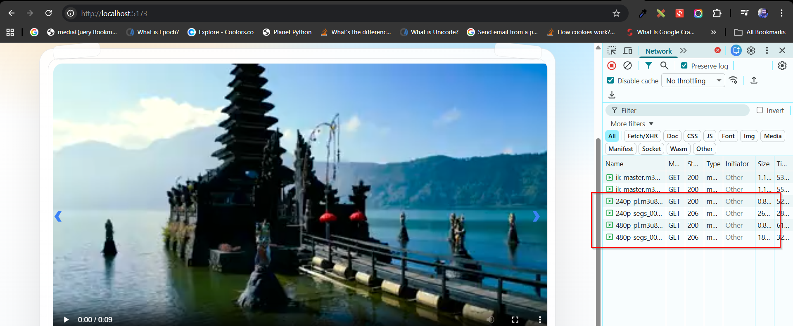
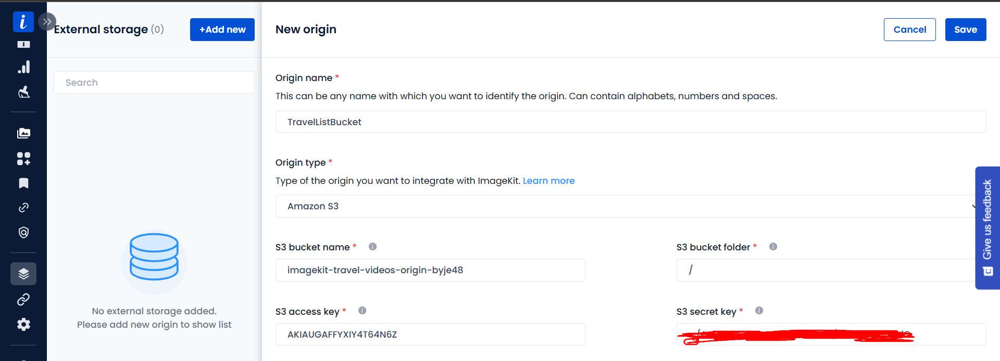

## 🎬 🎥 🔴 AWS Video Streaming app with Imagekit

Streaming S3 videos using Imagekit as an optimization and caching layer.

---

### 📌 Project Overview:

This project demonstrates how to stream videos stored in Amazon S3 using ImageKit as a CDN and optimization layer.

ImageKit supports multiple external storage origins, with S3 being one of them. After configuring S3 as an origin, ImageKit:

- Securely fetches videos using IAM credentials

- Applies on-the-fly transformations

- Caches content at edge locations

- Serves optimized media globally via CDN

This eliminates the need to store multiple processed versions of the same video while improving performance and scalability.

---

### Live Demo:

React App Demo to display imagekit videos stored in s3

ImageKit supports real-time video transformations (resize, trim, overlay, etc.) without requiring multiple stored versions of the same file.

**Resize demo**

**Trim demo** Original video length: 14 seconds → Trimmed to 5 seconds using transformation parameters.

**Adaptive bitrate** (ImageKit automatically delivers the most appropriate video resolution based on based on player size and network speed)

Connecting Imagekit with S3 by setting up an origin in imagekit

---

### 🏗️ Architecture Diagram:

---

### 🚀 Key Features:

- Imagekit integration with S3 as an external origin
- Video streaming via ImageKit with S3 origin
- On-the-fly video transformations (resize, trim, etc.)
- Secure ImageKit–S3 integration using IAM credentials
- AWS Infrastructure provisioning using Terraform
- Built a React frontend to consume optimized video URLs

---

### 🎯 Learning Objectives:

- Understand how to configure **Amazon S3 as an external origin** in ImageKit
- Learn how to securely connect third-party services using **IAM credentials**
- Implement **video streaming through a CDN layer**
- Apply **on-the-fly video transformations** (resize, trim, etc.)
- Understand how **adaptive bitrate streaming** improves user experience

---

### 👨‍💻 Connect with me:

**Ibrar Munir**

Github: https://github.com/ibrarmunircoder  
LinkedIn: https://www.linkedin.com/in/ibrar-munir-53197a16b   
Portfolio: https://ibrarmunir.d3psh89dj43dt6.amplifyapp.com
